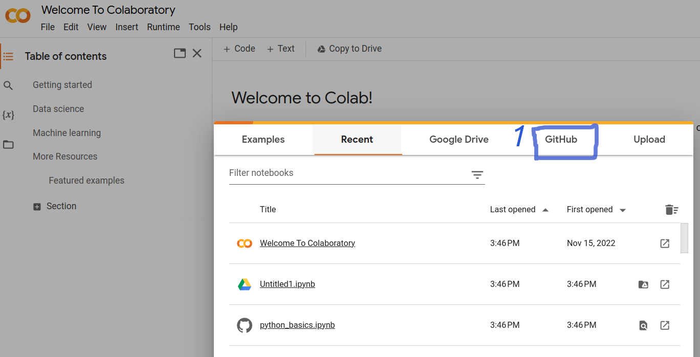
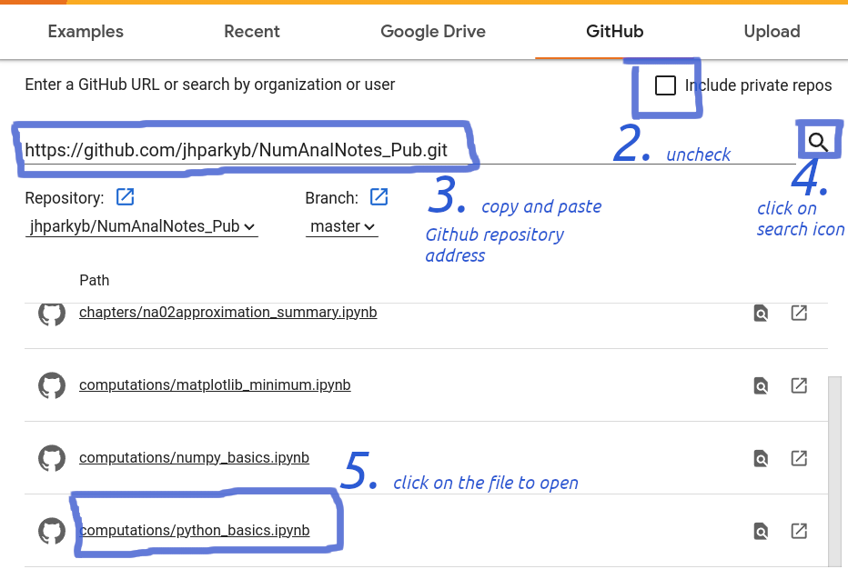
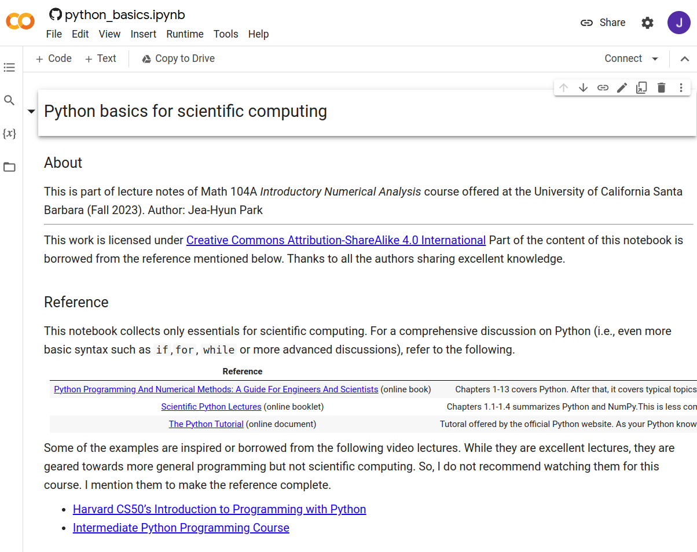

## About

This repository collects materials for Introductory Numerical Analysis by Jea-Hyun Park. 
Date created: 2023-09-22

## Design/Style of notes

The philosophy behind these notes is to collect various forms of materials in one place: text (statements, summaries, remarks), figures, computational implementations, handwritten notes, links to other resources (interactive modules, further references). 

- These notes must be supplemented by instructors' guides. These notes are not meant to be a textbook.
- Due to this style, readers should use "mathematical" reading skills: quite often, a single comment may be summarizing a very important fact, intuition, guidance for a big picture. 
- However, I have been trying to at least mention all important things.
- Some contents are not presented in its best form for now. For example, some slides-style figures may be better to be presented in text form. These will be updated over time.

## Computation environment

We use Python and Jupyter notebook.

### Google Colab

Google Colab has all necessary libraries set up, and you can interact with the notebooks with no installations.

1. Go to [Google Colab](https://colab.research.google.com/)

2. Open notebooks by importing from Github repository `https://github.com/jhparkyb/NumAnalNotes_Pub.git`. 

3. Notebook file is ready.

### Desktop/Laptop

Install the following language and libraries. If these look like a headache, use Google Colab. 

1. Python 3.8 +
2. NumPy
3. Matplotlib
4. Pandas 

Install the following editor. 
1. VS Code editor
2. Extensions for Jupyter notebook: Jupyter
3. Extensions for Markdown: e.g., Markdown Preview Enhanced
4. Other extensions that may be helpful, e.g., Pylance, Python, 

## Report errors

If you spot any errors, please report them to me at your earliest convenience.
- In person (preferred): After class or SH 6524 
- Email: jhpark1@ucsb.edu 

